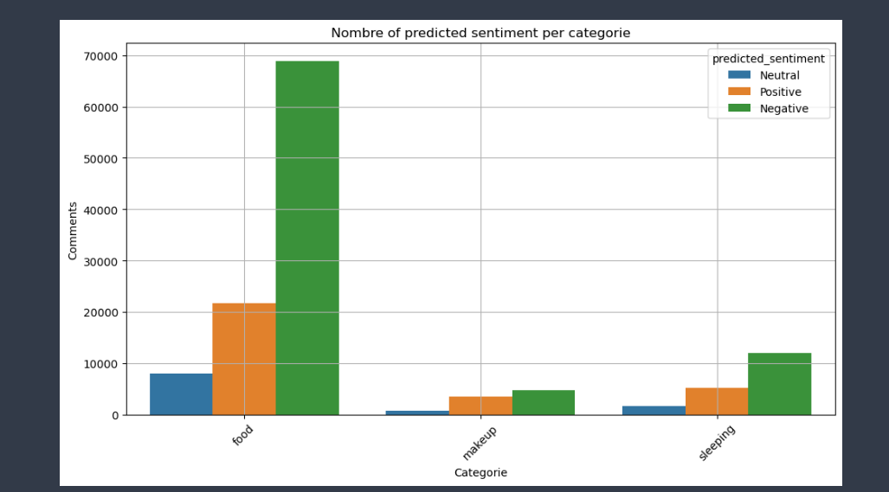

# 🎧 ASMR YouTube Comments Sentiment Classification

## 📌 Project Overview
This project focuses on **sentiment classification** of YouTube comments related to three popular ASMR content categories:
- **Food ASMR**
- **Sleeping / Massage ASMR**
- **Makeup ASMR**

We combine **public sentiment data from the IMDb dataset** with **scraped YouTube comments** from selected ASMR videos to train and evaluate a classification model. The goal is to automatically determine whether a comment is **Positive**, **Neutral**, or **Negative**.

---

## 📂 Dataset Sources
### 1. IMDb Movie Reviews Dataset
Used for initial sentiment model training:  
🔗 [IMDb Dataset of 50K Movie Reviews](https://www.kaggle.com/datasets/lakshmi25npathi/imdb-dataset-of-50k-movie-reviews)

### 2. YouTube Comments Dataset
Scraped directly from selected ASMR videos using the **YouTube Data API**.  
Videos were grouped into three categories:
- **Food ASMR** (Eating sounds, cooking whisper videos, etc.)
- **Sleeping ASMR** (Massage, relaxation, scalp massage, sleep triggers)
- **Makeup ASMR** (Soft speaking while applying makeup)

---

## 🔍 Project Workflow

### **1. YouTube Comments Scraping**
We use the `googleapiclient` library to extract YouTube comments. Each comment is tagged with:
- `category` (food, sleeping, makeup)
- `num_of_likes`
- `video_id`

```python
from googleapiclient.discovery import build
import pandas as pd

def get_comments(video_id, category):
    youtube = build('youtube', 'v3', developerKey='YOUR_API_KEY')
    comments = []
    request = youtube.commentThreads().list(part='snippet', videoId=video_id, maxResults=100)
    while request:
        response = request.execute()
        for item in response['items']:
            comment = item['snippet']['topLevelComment']['snippet']
            comments.append({
                'text': comment['textDisplay'],
                'category': category,
                'num_of_likes': comment['likeCount'],
                'video_id': video_id
            })
        request = youtube.commentThreads().list_next(request, response)
    return comments

df = pd.DataFrame(get_comments('VIDEO_ID', 'food'))
df.to_excel("Youtube_comments.xlsx", index=False)
```

### **2. Data Cleaning & Preprocessing**
We apply several preprocessing steps:
- Lowercasing text
- Removing links, HTML tags, and punctuation
- Removing numbers and special characters
- Filtering out English stopwords

```python
import re
import nltk
from nltk.corpus import stopwords

nltk.download('stopwords')
stop_words = set(stopwords.words('english'))

def review_cleaning(text):
    text = text.lower()
    text = re.sub(r'https?://\S+|www\.\S+', ' ', text)
    text = re.sub(r'<.*?>', '', text)
    text = re.sub(r'[^a-z\s]', ' ', text)
    text = ' '.join(word for word in text.split() if word not in stop_words)
    return text

df['cleaned_text'] = df['text'].apply(review_cleaning)
```

### **3. Sentiment Model**
We load a Transformer-based Keras model trained on IMDb reviews.

```python
from tensorflow.keras.models import load_model
import pickle
from tensorflow.keras.preprocessing.sequence import pad_sequences

model = load_model("transformer_classification_sentiment_model.h5")
with open("tokenizer.pickle", "rb") as handle:
    tokenizer = pickle.load(handle)

def predict_sentiment(text):
    sequence = tokenizer.texts_to_sequences([text])
    padded = pad_sequences(sequence, maxlen=100)
    prediction = model.predict(padded)[0][0]
    return "Positive" if prediction > 0.6 else "Negative" if prediction < 0.4 else "Neutral"

df['predicted_sentiment'] = df['cleaned_text'].apply(predict_sentiment)
```

### **4. Visualization**
We use Seaborn and Matplotlib to analyze sentiment distribution per category:
- Sentiment distribution for each category
- Total likes per category
- Overall sentiment comparison

```python
import seaborn as sns
import matplotlib.pyplot as plt

# Sentiment distribution by category
plt.figure(figsize=(10, 6))
sns.countplot(data=df, x='predicted_sentiment', hue='category', order=['Negative', 'Neutral', 'Positive'])
plt.title('Sentiment Distribution by ASMR Category')
plt.savefig('sentiment_distribution.png')
plt.close()

# Total likes by category
plt.figure(figsize=(10, 6))
sns.barplot(data=df.groupby('category')['num_of_likes'].sum().reset_index(), x='category', y='num_of_likes')
plt.title('Total Likes by ASMR Category')
plt.savefig('likes_by_category.png')
plt.close()
```

### 📊 Final Model Results


---

## 📦 Requirements
Make sure you have these Python packages installed:

```bash
pip install pandas numpy matplotlib seaborn tensorflow keras nltk google-api-python-client openpyxl
```

---

## ▶️ How to Run
1. Clone this repository:
   ```bash
   git clone https://github.com/yourusername/asmr-sentiment-classification.git
   cd asmr-sentiment-classification
   ```
2. Download the IMDb dataset and place it in the project folder.
3. Run the YouTube comments scraper:
   ```bash
   python scrape_youtube_comments.py
   ```
4. Clean and preprocess data:
   ```bash
   python preprocess_comments.py
   ```
5. Run sentiment prediction:
   ```bash
   python sentiment_classification.py
   ```
6. View results & plots — they will be saved as PNG files.

---

## 📌 Key Insights
- **Food ASMR** generally receives more **Positive** engagement.
- **Sleeping ASMR** has a balanced mix of **Neutral** and **Positive** sentiments.
- **Makeup ASMR** often gets shorter, casual, and highly **Positive** comments.
- The number of likes correlates with positive engagement.

---

## 📜 License
This project is open-source under the MIT License.
